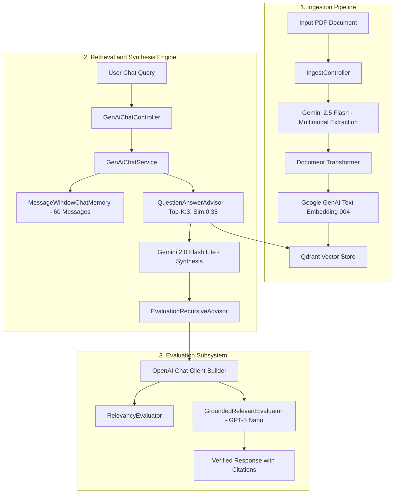

# System Architecture

DocIntel operates two primary subsystems: the **Multimodal Ingestion Pipeline** (for PDF parsing and dense vector indexation) and the **Retrieval & Synthesis Engine** (for grounded RAG queries, MCP tool execution, and continuous evaluation).

## High-Level Pipeline

## Subsystem Breakdown

### 1. Ingestion Pipeline
1. **Upload**: A client uploads a PDF file via multipart form submission to `/ingest/pdf/genai`.
2. **Temporary Storage**: `PdfService` writes the file to an isolated temporary directory to ensure safe streaming into memory.
3. **Multimodal Extraction**: `GenAiIMultiModalIngestionService` converts the file to raw bytes and sends it directly to **Gemini 2.5 Flash** alongside a strict JSON schema.
4. **Content Parsing**: Gemini extracts tabular data as Markdown tables, captures diagram and chart descriptions, formats OCR text, and wraps raw JSON structures.
5. **Document Transformation**: The extracted payload is parsed into individual Spring AI `Document` objects, appending page numbers, table lists, and image captions to document metadata.
6. **Vectorization & Indexing**: Documents are vectorized with **Google GenAI Text Embedding 004** (768 dimensions) and indexed into **Qdrant** using token-count batching.

### 2. Retrieval & Synthesis Engine
- **Conversation State**: Managed via `MessageWindowChatMemory` with a sliding window of 60 messages.
- **Context Retrieval**: Configured with `QuestionAnswerAdvisor`, querying Qdrant with `topK = 3` and a minimum similarity threshold of `0.35`.
- **Synthesis Model**: Powered by **Gemini 2.0 Flash Lite**, instructed to cite specific document references and avoid hallucinated facts.

### 3. Model Context Protocol (MCP) Integration
- Configured via `spring-ai-starter-mcp-client-webflux` with an asynchronous streamable HTTP transport targeting `http://localhost:8001`.
- Provides dynamic tool discovery through `ToolCallbackProvider`.
- Dedicated notifications for logging (`McpLogging`) and background task progress (`McpProgress`) are handled in `McpClientHandlers`.

### 4. Dual Evaluation Layer
- **EvaluationRecursiveAdvisor**: Intercepts the synthesis stream, evaluates relevancy, and recursively re-executes with corrective instructions if the score is below threshold (up to 2 iterations).
- **GroundedRelevantEvaluator**: Employs **OpenAI GPT-5 Nano** to assess both factual grounding against retrieved Qdrant context and answer relevancy to the user query.
