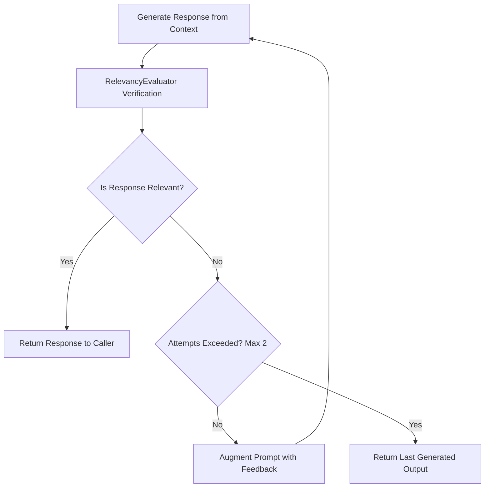

# Evaluation & Groundedness Layer

To prevent hallucinations, ensure provenance citation, and guarantee response relevance, DocIntel implements an automated evaluation subsystem.

## Recursive Evaluation Loop

The `EvaluationRecursiveAdvisor` intercepts each generation before returning it to the user. If the response fails relevancy verification, it automatically refines the prompt and requests a revised answer.



## Evaluator Implementations

DocIntel utilizes two distinct evaluators:

### 1. Spring AI `RelevancyEvaluator`
- Evaluates whether the generated response directly answers the user query based on the retrieved context documents.
- Runs inside `EvaluationRecursiveAdvisor` during runtime call chaining.

### 2. Custom `GroundedRelevantEvaluator`
Implemented as an independent Spring AI `Evaluator`, this component evaluates responses across two dimensions:
1. **Groundedness**: Are factual claims directly supported by the retrieved context chunks from Qdrant?
2. **Relevance**: Does the response directly and meaningfully answer the user query?

#### Scoring Formula
The evaluator returns a `CustomEvaluationResponse` structured as:

$$\text{Score} = 0.50 \times \text{grounded\_score} + 0.50 \times \text{relevance\_score}$$

#### Decision Matrix
- `grounded_score = 1.0`: Every factual claim is supported by context; penalized for unsupported or contradictory statements.
- `relevance_score = 1.0`: Answers the query directly without digression.
- **Safety Violation**: If PII or PCI information is detected, `grounded_score` is halved (`* 0.5`) and `"PII"` is added to the diagnostic feedback.
- **Passing Threshold**: A response passes (`pass: true`) if and only if:
  - $\text{score} \ge 0.7$
  - $\text{relevance\_score} \ge 0.6$

## Evaluation Output Sample

The output appended to chat responses includes detailed diagnostic metadata:

```text
Evaluation:
EvaluationResponse{
  pass=true,
  score=1.0,
  feedback='All factual claims grounded in Page 3 tables; answers query directly.',
  metadata={}
}
```
