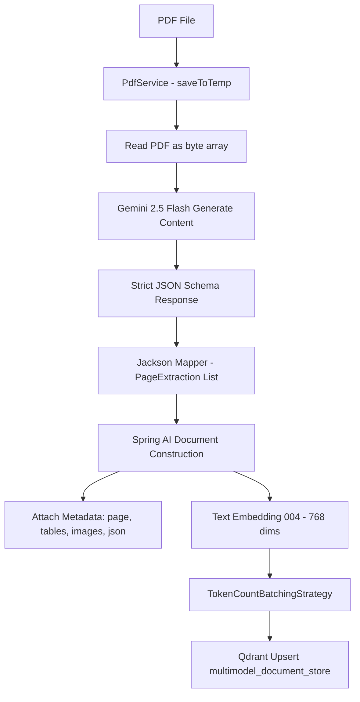

# Multimodal Ingestion Pipeline

The ingestion service converts unstructured and complex PDF documents into structured semantic chunks ready for vector retrieval.

## Ingestion Flow



## Structured Extraction Schema

To guarantee deterministic parsing from multimodal inputs, `SchemaBuildingHelper` generates a strict Gemini schema enforcing the following structure:

```json
[
  {
    "page_number": 1,
    "extracted_tables": ["| Metric | Value |\n| --- | --- |\n| Revenue | $10M |"],
    "images": [
      {
        "caption": "Quarterly revenue growth chart showing upward trend",
        "source": "Chart Section 2"
      }
    ],
    "json_blocks": [
      {
        "content": {
          "raw": "{\"system_status\": \"active\"}"
        }
      }
    ],
    "text_content": "Extracted paragraph body and OCR text."
  }
]
```

## Ingestion Prompting Strategy

The ingestion service sends the raw document bytes accompanied by the following multimodal instruction:

```text
Process this PDF page by page.
For each page:
1. Extract all tables and output them in valid Markdown.
2. Detect images/charts/diagrams and produce detailed captions.
3. Extract any JSON blocks and output valid JSON.
4. Extract all texts and output a valid json.
5. Identify and extract any OCR-like or machine-read text blocks verbatim and output a valid json.
Return strict JSON matching the provided schema.
```

## Vector Store Indexing

Each page is transformed into a canonical textual document:
1. Header: `Page <pageNumber>`
2. Tables section: Each table formatted in Markdown.
3. Images section: All visual captions.
4. JSON blocks section: Serialized JSON representations.
5. Fallback: If no content is found, an empty marker `Page <pageNumber> (empty)` is generated.

The canonical text is vectorized by `GoogleGenAiTextEmbeddingModel` and indexed into the Qdrant collection named `multimodel_document_store`.
