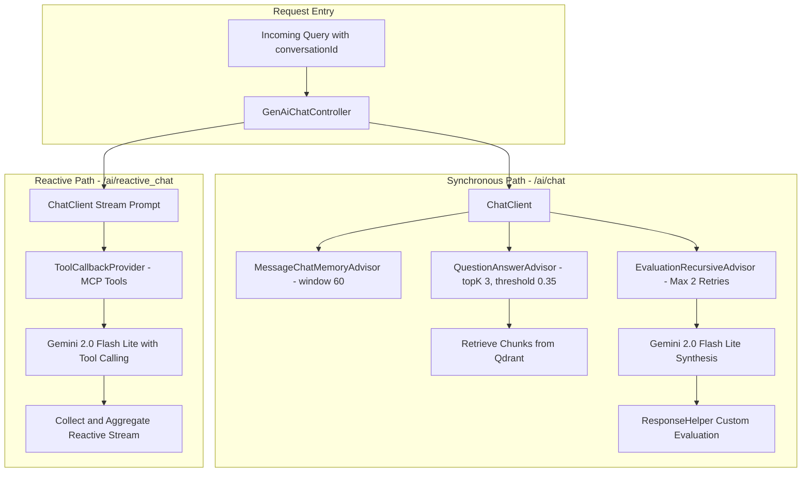

# RAG Pipeline & Chat Engine

DocIntel provides two chat modalities:
1. **Synchronous Grounded RAG** (`/ai/chat`): Context-augmented query answering backed by Qdrant vector retrieval, conversational memory, and automated evaluation.
2. **Reactive Streaming RAG** (`/ai/reactive_chat`): Non-blocking reactive pipeline (`Flux<ChatResponse>` / `Mono<String>`) enhanced with external tools via Model Context Protocol (MCP).

## Query Execution Architecture

## Advisor Pipeline

In the synchronous pipeline, `ChatClient` is configured with an ordered sequence of advisors:

1. **`MessageChatMemoryAdvisor`**:
   Maintains the active conversation history across turns using `MessageWindowChatMemory` with a sliding limit of 60 messages.
2. **`SimpleLoggerAdvisor`**:
   Intercepts requests and responses to log the selected model parameters and token usage metadata.
3. **`QuestionAnswerAdvisor`**:
   - `topK(3)`: Retrieves the top 3 most relevant page chunks from Qdrant.
   - `similarityThreshold(0.35)`: Drops candidate chunks below cosine similarity threshold.
   - Sets retrieved context in `chatResponse.getMetadata().get("qa_retrieved_documents")`.
4. **`EvaluationRecursiveAdvisor`**:
   Validates the synthesis using `RelevancyEvaluator` and recursively executes up to 2 prompt refinements if the answer is judged non-relevant.

## Reactive MCP Streaming

The `/ai/reactive_chat` endpoint uses Spring AI's WebFlux integration:

- **System Instruction**: Directs the agent to discover and invoke MCP tools, gather factual evidence, and synthesize results without making ungrounded assumptions.
- **Dynamic Tool Execution**: `mcpToolProvider` binds client tools discovered from the MCP server at `http://localhost:8001`.
- **Stream Reducer**: Emits chunks via `Flux<ChatResponse>`, extracts assistant messages, and reduces the stream into a clean `Mono<String>` with a 30-second timeout guarantee.
